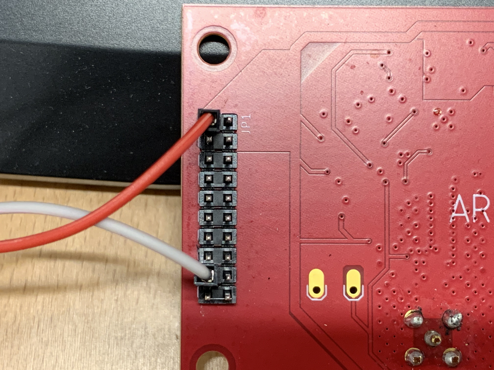
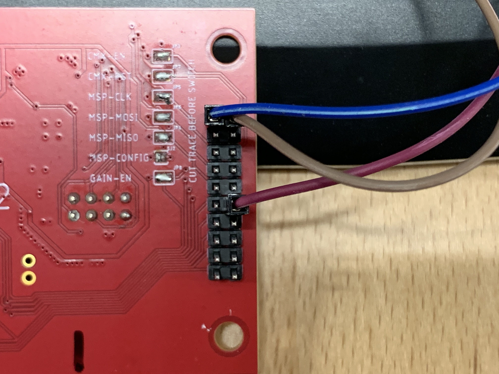
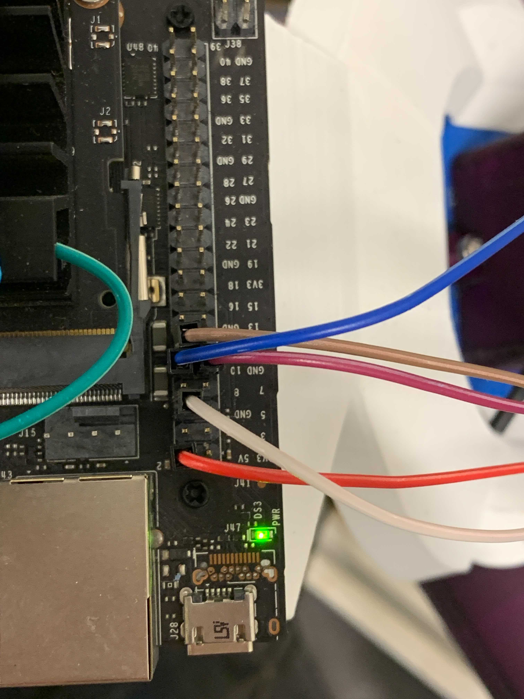

# ExacterMMV

<h4>Before You Start</h4>

Refer to the photos for wiring the Exacter sensor board to the Nvidia Jetson. 

The first photo features the JP1 pin header with the red wire connected to the 3.3v-5.5v power pin and the gray wire connected to the ground pin. 



The second photo features the JP2 pin header with the blue wire connected to the MSP TX pin, the brown wire connected to the Qualified Signal pin, and the Purple wire connected to the ground pin.



The third photo features the Nvidia Jetson's J41 Expansion pin header where the red wire is connected to pin 2 which is the 5v power pin, the gray wire is connected to pin 6 which is a ground pin, the purple wire is connected to pin 9 which is a ground pin, the blue wire is connected to pin 10 which is the RXD pin, and the brown wire is connected to pin 12 which is the DAP4-SCLK pin.



The stock Jetson Nano starts a console on the ttyTHS1 serial port at startup through a service. The script that starts the service is nvgetty.sh which launches getty. The script is located in /etc/systemd. While this does not conflict with the script presented here, consider disabling the console if you are using the serial port to avoid conflicts. Note that normal udev rules will be overridden by the console while the service is running. To disable the console:

```
$ systemctl stop nvgetty
$ systemctl disable nvgetty
$ udevadm trigger
# You may want to reboot instead
```

<h4>The ExacterMMV Script</h4>

When running the exacterMMV.py script, the user will enter a distance, then the script 
will output the Qualified bit and the MMV. When the program is stopped, a .CSV file named 
"Input_Data.csv" is created that contains the Distance, Qualified bit, and MMV for each 
measurement taken.

The script requires py-serial. To install py-serial:

```
$ sudo apt-get install python3-serial

```
Then to run the script:

```
$ sudo python3 exacterMMV.py

```
